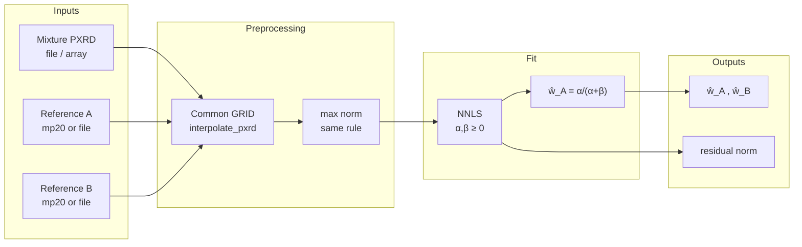

# Mix2Phase-QPA — Full Documentation

**English name**: Mix2Phase-QPA (**Mix**ture **2**-**Phase** Quantitative Phase Analysis)  
**Chinese (short)**: binary powder-mixture PXRD **linear quantitative phase analysis** (two reference patterns + **NNLS**)

> This document is an **English translation** of [`Mix2Phase-QPA_全文.md`](Mix2Phase-QPA_全文.md), merged for single-file distribution and search.

---

## Table of contents

1. [Deliverable overview, artifacts, and reproduction](#0-deliverable-overview-artifacts-and-reproduction)
2. [Scope and naming](#1-scope-and-naming)
3. [Task definition, physics, and lab value](#2-task-definition-physics-and-lab-value) (subsection **5. Prerequisites**)
4. [I/O, pipeline, flowchart, examples](#3-io-pipeline-flowchart-examples)
5. [Results: 20 simulated samples](#4-results-20-simulated-samples)
6. [Algorithm and why it works](#5-algorithm-and-why-it-works)
7. [Script entry points (brief)](#6-script-entry-points-brief)

---

## 0. Deliverable overview, artifacts, and reproduction

This repository bundles **Mix2Phase-QPA**: narrative, workflow, **20** citable simulation results, and algorithm notes. Core scripts live under `scripts/`; expected runtime data paths are documented in `data/README.md`.

### Artifacts

| Path | Description |
| --- | --- |
| `results/eval20_summary.json` | Machine-readable summary for the 20-sample evaluation |
| `results/q1_eval20_run/` | Per-sample folders with `mix.xy` (two columns: 2θ°, intensity) |
| `results/fixed_pair_w10_summary.json` | Summary for the fixed-A/B, 10-ratio horizontal sweep |
| `results/fixed_pair_w10_run/` | The 10 `mix.xy` files used in the horizontal sweep |

### One-command reproduction

```bash
bash scripts/run_eval20.sh
bash scripts/run_fixed_pair_w10.sh
```

(The wrappers also write helper reports under `results/_autogen/`; **use Section 4 tables in this file as canonical**.)

### Dependencies (short)

- **Code**: `scripts/algo_qpa_mixture_nnls.py`, `scripts/algo_qpa_q1_cif_xy.py`, `scripts/algo_qpa_q1_eval_pair50.py`
- **Data**: expected at `data/pair1k_v3/*.lmdb`, mp20 at `data/mp20_data/test.lmdb`
- **Python**: numpy, scipy, lmdb, pymatgen (see root `requirements.txt`)

---

## 1. Scope and naming

### Naming

| Term | Meaning |
| --- | --- |
| **Mix2Phase-QPA** | **Mix**ture **2**-**Phase** **Q**uantitative **P**hase **A**nalysis |
| **Chinese** | binary powder PXRD **linear QPA** (two references + NNLS) |

The name stresses: **mixture input**, **exactly two crystalline phases**, **quantitative fractions**; the core is **non-negative linear fitting**, not a neural network.

### In scope / out of scope

| ✅ In scope | ❌ Not included |
| --- | --- |
| **Exactly two phases A, B** are known, each with a **usable single-phase PXRD** | Automatic **phase ID from the mixture alone** (needs prior identification) |
| Decompose the mixture as a **non-negative linear combo** of two references; read **phase-A fraction** \(\hat w_A\in[0,1]\) | **Full Rietveld refinement** (only an approximation without structure / texture models) |
| On **simulation / file data**, can match label **`w1`** to **10⁻³–10⁻⁴** when references and mixture are **co-generated** | **No guarantee** that raw lab patterns match simulation labels without preprocessing (**domain gap**) |

### Relation to earlier work

- This document focuses on the current **Mix2Phase-QPA** mainline.
- Earlier deep-learning routes and archived experiments are historical context, not the primary entry point of this repository.

---

## 2. Task definition, physics, and lab value

### 1. What problem does it solve?

**Problem**: Given **one powder-mixture PXRD** \(I_{\mathrm{mix}}(2\theta)\), estimate **relative weight of two known phases A and B** (in simulation, **`w1`** is the weight of A, \(w_B=1-w_1\)).

**Minimal math goal**: Find \(\alpha,\beta\ge 0\) with \(\mathbf y_{\mathrm{mix}} \approx \alpha\,\mathbf y_A + \beta\,\mathbf y_B\), then \(\hat w_A = \alpha/(\alpha+\beta)\) under the agreed normalization.

### 2. Physical setting

1. **Only A and B** contribute dominantly to diffraction.  
2. **Structures (or cards) for A, B** are known, and **single-phase reference patterns** exist (standards, matched simulation, or mp20-interpolated patterns in this repo).  
3. **Random powder** statistics and **moderate absorption contrast** → first-order **non-negative linear combination**.

### 3. Why it helps experiments

| Benefit | Note |
| --- | --- |
| **Fast quantitative read** | When peaks overlap, \(\hat w_A\) is still **reproducible**. |
| **Upper bound vs deep learning** | With co-generated simulation, NNLS nearly saturates the label → if a neural net is much worse, look at **domain gap / representation**. |
| **Clean interface** | “Mixture + two references” fits **ID → library lookup → decomposition**. |

### 4. Limitations

- **Not** “one pattern solves an unknown system”; phases must be fixed first.  
- References and mixture must share a **common scale** (grid, normalization, instrument response).  
- **Diffraction weight ≠ strict mass fraction** when absorption differs strongly.

### 5. Prerequisites

Beyond “**single-phase PXRD for A and B is known / queryable**” (or can be generated under the **same conventions** as the mixture), the items below **together** determine whether Mix2Phase-QPA is **trustworthy**. If violated, the code may still output \(\hat w_A\), but errors usually reflect **model mismatch**, not NNLS numerical precision.

**Sample and phases**

| Prerequisite | Explanation |
| --- | --- |
| **Phase ID done** | Diffraction should be dominated **only by A and B**; strong amorphous halos, unknown third phases, or strong texture mimicking a third phase break the two-column model. |
| **Nearly random powder** | Enables **non-negative linear superposition** of phase contributions; strong texture needs richer models or preprocessing. |
| **Moderate absorption contrast** | Linear weights act like **diffraction weights**; large absorption / micro-absorption mismatch means \(\hat w\) **is not** a rigorous mass fraction—use corrections or full-pattern methods (e.g. Rietveld). |

**Patterns and conventions**

| Prerequisite | Explanation |
| --- | --- |
| **Same 2θ grid and intensity convention** | Mixture and both references need **identical interpolation / trimming** and **identical normalization** (e.g. max=1 per pattern); otherwise vectors live in mismatched spaces. |
| **Comparable broadening and shape** | If references come from another simulator or instrument and **instrument function, peak width, background** disagree with the mixture, \(\mathbf y_{\mathrm{mix}}\) leaves \(\mathrm{span}^+\{\mathbf y_A,\mathbf y_B\}\): residuals grow and \(\hat w\) loses physical meaning. |
| **Weak or modeled background** | Fitting strong background with only two phase columns **soaks bias into coefficients**; subtract background or augment the design matrix (constant / polynomial terms). |

**Implementation and method boundaries**

| Prerequisite | Explanation |
| --- | --- |
| **Consistent library indexing** | For mp20 / LMDB, reference indices must match pair construction: **cursor iteration order**, **not** ad hoc keys like `txn.get(str(k))`. |
| **Not structural refinement** | The method returns the **best nonnegative mixture of two references**, not refined coordinates / site occupancy; use Rietveld etc. when crystallographic detail matters. |

**One-liner**: besides queryable A/B patterns, you need a **true two-phase-dominated sample**, **patterns on a common grid and scale**, and **conditions close to linear superposition** (powder, moderate absorption, controlled background).

---

## 3. I/O, pipeline, flowchart, examples

### 1. Inputs / outputs (summary)

| Role | Content | Typical form |
| --- | --- | --- |
| **Mixture PXRD** | \(y_{\mathrm{mix}}\) | `.xy/.csv` (2θ, I); or `.npy` length 1200 |
| **References A/B** | \(y_A,y_B\) **lookup** | mp20 **`test.lmdb` cursor-order index** (same as `src_idx_*`); or **files** |
| **Outputs** | \(\hat w_A,\hat w_B\) | JSON / stdout; residual \(\|\mathbf y_{\mathrm{mix}}-\alpha\mathbf y_A-\beta\mathbf y_B\|_2\) |

**Important**: mp20 integer indices follow **cursor traversal order**, **not** `txn.get(str(k))` string-key semantics.

### 2. Pipeline (text)

1. **Grid alignment**: 0–120°, step 0.1°, 1200 points, `interpolate_pxrd`.  
2. **Intensity rule**: each pattern **max-normalized to 1** (as in `pair1k_v3`).  
3. **NNLS**: \(\min_{\alpha,\beta\ge 0}\|\mathbf y_{\mathrm{mix}} - [\mathbf y_A\ \mathbf y_B][\alpha,\beta]^T\|_2\).  
4. **Read fraction**: \(\hat w_A=\alpha/(\alpha+\beta)\).

### 3. Flowchart (Mermaid)



### 4. CLI examples

**Recommended (mp20 lookup)**:

```bash
cd /path/to/Mix2Phase-QPA
python3 scripts/algo_qpa_mixture_nnls.py \
  --mixture /path/to/mix.xy \
  --ref-a-mp20 1387 \
  --ref-b-mp20 8021 \
  --json-out results/_autogen/mix2phase_out.json
```

**References from files**:

```bash
python3 scripts/algo_qpa_mixture_nnls.py \
  --mixture mix.xy --ref-a ref_A.xy --ref-b ref_B.xy
```

**Demo**:

```bash
python3 scripts/algo_qpa_mixture_nnls.py --demo
```

### 5. vs. CIF → XRDC fallback

`algo_qpa_q1_cif_xy.py` builds references from **CIF + XRDCalculator**; if that chain **differs** from mp20-stored peaks, \(\hat w\) vs. **`w1`** can **diverge strongly**. Mix2Phase-QPA **prefers table lookup**.

### 6. Example mixture files in this bundle

**`results/q1_eval20_run/*/mix.xy`** can be passed directly as `--mixture`.

---

## 4. Results: 20 simulated samples

This section first reports the **20 randomly sampled cases**, then adds one **fixed-A/B ratio sweep** to isolate a different question: when phase identities stay unchanged and only \(w_A\) changes, can Mix2Phase-QPA still recover the ratio stably?

### 1. Evaluation setup

| Item | Value |
| --- | --- |
| Data | `data/pair1k_v3/test.lmdb` |
| Sampling | **20** pairs without replacement, `seed=42` |
| Method | `mix.xy` + mp20 **cursor-order** references + max norm + NNLS |

### 2. Aggregate errors

| Metric | Value |
| --- | --- |
| MAE(\(\|\hat w_A - w_1\|\)) | **6.60×10⁻⁴** |
| RMSE | **7.90×10⁻⁴** |
| max \(\|e\|\) | **1.39×10⁻³** |

### 3. Per-sample table

Paths are relative to the repository root.

| # | pair | A | B | mixture PXRD | \(w_1\) | \(\hat w_1\) | \(\|e\|\) |
| --- | --- | --- | --- | --- | --- | --- | --- |
| 1 | 8 | mp20[1387] MoNb3Se8 | mp20[8021] Rh6Sn10Tb4 | `results/q1_eval20_run/000_pair0008/mix.xy` | 0.491759 | 0.492084 | 0.000325 |
| 2 | 9 | mp20[4937] S8Tb4Yb2 | mp20[1325] CuTe6Th2 | `results/q1_eval20_run/001_pair0009/mix.xy` | 0.616726 | 0.615894 | 0.000833 |
| 3 | 14 | mp20[446] Ho3Mn8Tm | mp20[4963] Mn2Si2Sm | `results/q1_eval20_run/002_pair0014/mix.xy` | 0.968152 | 0.967566 | 0.000586 |
| 4 | 20 | mp20[3406] Cd2Ho | mp20[4617] Ce2Ru2Si2 | `results/q1_eval20_run/003_pair0020/mix.xy` | 0.670527 | 0.670077 | 0.000450 |
| 5 | 42 | mp20[1763] Ga2Gd2Zn2 | mp20[6233] CrRuV2 | `results/q1_eval20_run/004_pair0042/mix.xy` | 0.897469 | 0.897239 | 0.000230 |
| 6 | 50 | mp20[1245] Co6Nd3Sn5 | mp20[829] Co6Ge6Ho | `results/q1_eval20_run/005_pair0050/mix.xy` | 0.840651 | 0.841960 | 0.001309 |
| 7 | 54 | mp20[3064] Cl12Rb2Ta2 | mp20[1873] H12Mg4Na4 | `results/q1_eval20_run/006_pair0054/mix.xy` | 0.313685 | 0.313231 | 0.000455 |
| 8 | 55 | mp20[3142] Ba4Sb8Zn8 | mp20[4512] AlNi2Yb2 | `results/q1_eval20_run/007_pair0055/mix.xy` | 0.955436 | 0.956660 | 0.001224 |
| 9 | 62 | mp20[429] IrLiTi2 | mp20[5687] Cl12Dy2Na6 | `results/q1_eval20_run/008_pair0062/mix.xy` | 0.846184 | 0.844790 | 0.001394 |
| 10 | 69 | mp20[4085] Se4Te4U4 | mp20[6403] Nd2O8Ta2 | `results/q1_eval20_run/009_pair0069/mix.xy` | 0.167545 | 0.168659 | 0.001114 |
| 11 | 72 | mp20[793] Ce2Ni2Zn | mp20[8735] As2K6 | `results/q1_eval20_run/010_pair0072/mix.xy` | 0.897233 | 0.897173 | 0.000060 |
| 12 | 76 | mp20[447] Cu4S8Tm4 | mp20[7349] IrTcTi2 | `results/q1_eval20_run/011_pair0076/mix.xy` | 0.667119 | 0.667834 | 0.000716 |
| 13 | 77 | mp20[4608] Ca2Cu4O8 | mp20[3288] Al6Pu2 | `results/q1_eval20_run/012_pair0077/mix.xy` | 0.304789 | 0.305252 | 0.000464 |
| 14 | 80 | mp20[1029] F6Na2U | mp20[8446] Cl2O2V2 | `results/q1_eval20_run/013_pair0080/mix.xy` | 0.845331 | 0.846503 | 0.001172 |
| 15 | 84 | mp20[2565] Hg5In2Te8 | mp20[7720] F2Mn4O6 | `results/q1_eval20_run/014_pair0084/mix.xy` | 0.765189 | 0.765467 | 0.000277 |
| 16 | 93 | mp20[8801] B6Fe3Tb4 | mp20[5595] Nb6RbSe8 | `results/q1_eval20_run/015_pair0093/mix.xy` | 0.100568 | 0.100859 | 0.000291 |
| 17 | 96 | mp20[6416] Li4O10Ti4 | mp20[1472] La3Mn4Si4Y | `results/q1_eval20_run/016_pair0096/mix.xy` | 0.567779 | 0.566463 | 0.001317 |
| 18 | 98 | mp20[3771] Cr2Cu2S8Zr2 | mp20[5810] Co4Pr2 | `results/q1_eval20_run/017_pair0098/mix.xy` | 0.298595 | 0.298910 | 0.000315 |
| 19 | 101 | mp20[3731] F10Mo2 | mp20[3244] Ga2Sm2 | `results/q1_eval20_run/018_pair0101/mix.xy` | 0.011631 | 0.011574 | 0.000056 |
| 20 | 107 | mp20[2298] Fe10Re2Y | mp20[2952] F12Li6V2 | `results/q1_eval20_run/019_pair0107/mix.xy` | 0.820094 | 0.820708 | 0.000614 |

### 4. Fixed A/B sweep across 10 ratios

To complement the random-sample evaluation, we selected one representative pair from the **50-case test**:

- source: **`pair_idx=73`** from an earlier 50-sample evaluation
- fixed phases: **A = `mp20[2155] BaCu2O4Sr`**, **B = `mp20[3497] Ga2H2O4`**
- why this pair: it has a **small single-point error** in the 50-case test and a **mid-range** original ratio, making it suitable for a horizontal sweep

We then synthesize 10 mixtures from the same lookup references:

\[
\mathbf y_{\mathrm{mix}} = w_A \mathbf y_A + (1-w_A)\mathbf y_B,\quad
w_A \in \{0.05,0.15,\dots,0.95\}.
\]

Each synthetic `mix.xy` is written to disk and then reloaded through the same main pipeline: **`mix.xy` → max normalization → NNLS**.

#### Aggregate errors (10 cases)

| Metric | Value |
| --- | --- |
| MAE(\(\|\hat w_A - w_A\|\)) | **1.82×10⁻¹⁰** |
| RMSE | **2.11×10⁻¹⁰** |
| max \(\|e\|\) | **3.98×10⁻¹⁰** |

These errors are essentially at **floating-point / write-read rounding level**, because both the mixtures and the fitting references come from the **same lookup spectra** and exactly follow the same linear model.

#### Per-case table (fixed A/B)

| # | A | B | mixture PXRD | \(w_A\) true | \(\hat w_A\) predicted | \(\|e\|\) |
| --- | --- | --- | --- | --- | --- | --- |
| 1 | mp20[2155] BaCu2O4Sr | mp20[3497] Ga2H2O4 | `results/fixed_pair_w10_run/00_w050/mix.xy` | 0.050000 | 0.050000 | 2.23e-10 |
| 2 | mp20[2155] BaCu2O4Sr | mp20[3497] Ga2H2O4 | `results/fixed_pair_w10_run/01_w150/mix.xy` | 0.150000 | 0.150000 | 2.81e-10 |
| 3 | mp20[2155] BaCu2O4Sr | mp20[3497] Ga2H2O4 | `results/fixed_pair_w10_run/02_w250/mix.xy` | 0.250000 | 0.250000 | 1.04e-10 |
| 4 | mp20[2155] BaCu2O4Sr | mp20[3497] Ga2H2O4 | `results/fixed_pair_w10_run/03_w350/mix.xy` | 0.350000 | 0.350000 | 2.37e-10 |
| 5 | mp20[2155] BaCu2O4Sr | mp20[3497] Ga2H2O4 | `results/fixed_pair_w10_run/04_w450/mix.xy` | 0.450000 | 0.450000 | 2.03e-10 |
| 6 | mp20[2155] BaCu2O4Sr | mp20[3497] Ga2H2O4 | `results/fixed_pair_w10_run/05_w550/mix.xy` | 0.550000 | 0.550000 | 1.96e-10 |
| 7 | mp20[2155] BaCu2O4Sr | mp20[3497] Ga2H2O4 | `results/fixed_pair_w10_run/06_w650/mix.xy` | 0.650000 | 0.650000 | 3.82e-11 |
| 8 | mp20[2155] BaCu2O4Sr | mp20[3497] Ga2H2O4 | `results/fixed_pair_w10_run/07_w750/mix.xy` | 0.750000 | 0.750000 | 3.98e-10 |
| 9 | mp20[2155] BaCu2O4Sr | mp20[3497] Ga2H2O4 | `results/fixed_pair_w10_run/08_w850/mix.xy` | 0.850000 | 0.850000 | 3.11e-11 |
| 10 | mp20[2155] BaCu2O4Sr | mp20[3497] Ga2H2O4 | `results/fixed_pair_w10_run/09_w950/mix.xy` | 0.950000 | 0.950000 | 1.05e-10 |

#### What this sweep shows

Compared with the 20 random cases, this sweep removes the “changing phase identity” factor and keeps only the “changing ratio” factor. It directly shows that:

1. for fixed A/B, **\(\hat w_A\) tracks \(w_A\) smoothly and stably**;
2. under a fully matched linear-generation setting, ratio recovery is effectively **numerically exact**;
3. the \(10^{-4}\sim10^{-3}\) errors seen in random multi-pair tests mainly come from **phase-to-phase variation, interpolation, and numerical mismatch**, not from the fixed-A/B ratio inversion itself.

---

## 5. Algorithm and why it works

### 1. Model

\[
\mathbf y_{\mathrm{mix}} \approx \alpha\,\mathbf y_A + \beta\,\mathbf y_B,\qquad \alpha,\beta\ge 0,
\]
\(\hat w_A = \alpha/(\alpha+\beta)\).

### 2. Why NNLS?

- **Physics**: contributions are nonnegative.  
- **Convexity**: quadratic loss + nonnegative constraints → stable solvers.  
- **Extensible**: add background columns (watch sign constraints).

### 3. Why simulation looks “perfect”?

\(y_A,y_B,y_{\mathrm{mix}}\) are **co-generated** with identical normalization → \(\mathbf y_{\mathrm{mix}}\) lies almost in the **nonnegative cone** \(\mathrm{span}^+\{\mathbf y_A,\mathbf y_B\}\) → MAE ~ **10⁻⁴**.

### 4. Why experiments are harder?

Different instrument / simulation pipeline → leaves the 2D cone → large residuals, sensitive \(\hat w\); mitigate with **instrument convolution, background, measured standards**.

### 5. Summary

| Stage | Takeaway |
| --- | --- |
| Assumptions | Two phases + linear superposition + trustworthy references |
| Algorithm | NNLS → \(\hat w_A\) |
| Simulation | Linear label → **high accuracy** (sanity-check implementation) |
| Experiment | Align pattern shapes before arguing against heavier models |

---

## 6. Script entry points (brief)

Implementation: **`scripts/`**. Reproduce this bundle:

```bash
bash scripts/run_eval20.sh
bash scripts/run_fixed_pair_w10.sh
```

Day-to-day inference:

```bash
cd /path/to/Mix2Phase-QPA
python3 scripts/algo_qpa_mixture_nnls.py \
  --mixture /path/to/mix.xy \
  --ref-a-mp20 <cursor_index_A> --ref-b-mp20 <cursor_index_B>
```

See **`scripts/README.md`** for more.
