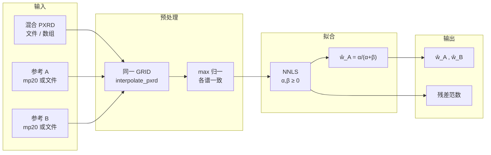

# Mix2Phase-QPA 全文

**英文名**：Mix2Phase-QPA（**Mix**ture **2**-**Phase** Quantitative Phase Analysis）  
**中文**：混合粉末 PXRD **双相线性定量**（双参考谱 + **NNLS**）

> 本文档为项目级单文件说明，便于公开分发与检索。

---

## 目录

1. [交付说明、结果路径与复现](#〇交付说明结果路径与复现)
2. [方案总览与命名](#一方案总览与命名)
3. [任务定义、物理场景与实验价值](#二任务定义物理场景与实验价值)（含 [§5 前置条件清单](#5-前置条件清单)）
4. [输入输出、Pipeline、流程图与示例](#三输入输出pipeline流程图与示例)
5. [20 条仿真样本结果](#四20-条仿真样本结果)
6. [算法原理与可行性](#五算法原理与可行性)
7. [脚本入口（简要）](#六脚本入口简要)

---

## 〇、交付说明、结果路径与复现

本仓库汇总 **Mix2Phase-QPA** 的方案说明、流程、**20 条**可引用仿真结果与算法原理。核心脚本位于 `scripts/`；运行时数据路径约定见 `data/README.md`。

### 结果产物

| 路径 | 说明 |
| --- | --- |
| `results/eval20_summary.json` | 20 样本评测机器可读汇总 |
| `results/q1_eval20_run/` | 各样本子目录 `mix.xy`（两列：2θ°、强度） |
| `results/fixed_pair_w10_summary.json` | 固定一对 A/B、扫描 10 个比例的横向对比汇总 |
| `results/fixed_pair_w10_run/` | 横向对比中 10 条 `mix.xy` |

### 一键复现

```bash
bash scripts/run_eval20.sh
bash scripts/run_fixed_pair_w10.sh
```

（评测脚本会额外生成 `results/_autogen/` 下的辅助报告；**表格以本文第四章为准**。）

### 依赖（简要）

- **代码**：`scripts/algo_qpa_mixture_nnls.py`、`scripts/algo_qpa_q1_cif_xy.py`、`scripts/algo_qpa_q1_eval_pair50.py`
- **数据**：期望路径为 `data/pair1k_v3/*.lmdb` 与 `data/mp20_data/test.lmdb`
- **Python**：numpy、scipy、lmdb、pymatgen（见根目录 `requirements.txt`）

---

## 一、方案总览与命名

### 命名

| 称谓 | 含义 |
| --- | --- |
| **Mix2Phase-QPA** | **Mix**ture **2**-**Phase** **Q**uantitative **P**hase **A**nalysis |
| **中文** | **混合粉末 PXRD 双相线性定量**（双参考谱 + NNLS） |

命名强调：**混合谱输入**、**恰好两晶相**、**定量占比**；算法核心是 **线性叠加假设下的非负拟合**，而非神经网络。

### 本方案是什么 / 不是什么

| ✅ 本方案 | ❌ 不包含 |
| --- | --- |
| 已知「恰有两晶相 A、B」且各有 **可参考的单相 PXRD 曲线** | 从混合谱自动 **检索有哪些物相**（需前置相鉴定） |
| 将混合谱分解为两参考谱的 **非负线性组合**，读出 **A 相比例** \(\hat w_A\in[0,1]\) | 替代 **Rietveld 全谱精修**（无结构精修、无择优取向精细模型时仅为近似） |
| **仿真 / 文件数据**上可与标签 **`w1`** 对齐到 **10⁻³～10⁻⁴** 量级（参考谱与混合谱同源时） | 保证 **实测仪器谱**不经预处理就与仿真标签一致（存在 domain gap） |

### 与历史工作的关系

- 本文档聚焦 **Mix2Phase-QPA** 当前主线。
- 早期深度学习路线与归档实验仅作为历史背景，不是本仓库的主要使用入口。

---

## 二、任务定义、物理场景与实验价值

### 1. 具体解决什么任务？

**任务**：在给定 **一条混合粉末 PXRD** \(I_{\mathrm{mix}}(2\theta)\) 的前提下，估计 **两已知晶相 A、B 的相对含量权重**（仿真中以 **`w1`** 表示 A 相权重，\(w_B=1-w_1\)）。

**数学目标（最小可行）**：找 \(\alpha,\beta\ge 0\)，使 \(\mathbf y_{\mathrm{mix}} \approx \alpha\,\mathbf y_A + \beta\,\mathbf y_B\)，并在约定归一化下 \(\hat w_A = \alpha/(\alpha+\beta)\)。

### 2. 用于什么物理场景？

1. 样品中 **只有两晶相对衍射有主要贡献**。  
2. **A、B 结构（或卡片）已知**，且能准备 **单相参考谱**（标样、一致模拟、或本仓库 mp20 插值谱）。  
3. **随机取向粉末**，吸收对比不强 → 一级近似下 **非负线性组合**。

### 3. 对实验有什么帮助？

| 帮助点 | 说明 |
| --- | --- |
| **快速定量直觉** | 峰重叠严重时给出 **可重复** \(\hat w_A\)。 |
| **与深度学习对照的上界** | 同源仿真下 NNLS 几乎吃满标签 → 深度模型若差很多，问题在 **domain gap / 表示**。 |
| **接口清晰** | 「混合谱 + 两条参考谱」易接入 **相鉴定 → 查库 → 分解**。 |

### 4. 局限性

- **不是**「单谱解未知体系」；相须先定。  
- 参考谱与混合谱须 **同一标度体系**（网格、归一化、仪器函数）。  
- **衍射权重 ≠ 严格质量分数**（吸收差大时需更完整模型）。

### 5. 前置条件清单

除「**A、B 的单相 PXRD 已知可查**」（或可生成并与混合谱遵守同一约定）之外，以下条件与参考谱 **并列**，共同决定 Mix2Phase-QPA **是否可信**。若不满足，程序仍可给出 \(\hat w_A\)，但误差往往反映 **模型失配**，而非 NNLS 数值精度。

**相与样品**

| 条件 | 说明 |
| --- | --- |
| **相鉴定已完成** | 对衍射 **主要贡献** 须近似 **只有 A、B**；大量非晶晕、未知第三相，或强择优取向导致的「等效第三相」，都会破坏两列线性模型。 |
| **近似随机取向粉末** | 便于把强度写成各相 **非负线性叠加**；强择优取向需更复杂模型或预处理。 |
| **吸收对比不过激** | 线性权重更接近 **衍射权重**；吸收 / 微吸收差异大时，\(\hat w\) **不等于** 严格质量分数，宜配合修正或 Rietveld 类全谱模型。 |

**谱与数据约定**

| 条件 | 说明 |
| --- | --- |
| **同一 2θ 网格与同一强度约定** | 混合谱与两条参考须经 **同一插值 / 裁边**，并用 **同一归一化**（如各谱 max=1）；否则向量不在同一内积空间里比较。 |
| **展宽与谱形可比** | 参考来自模拟或另一台仪器时，若 **仪器函数、峰宽、背景** 与混合观测不一致，\(\mathbf y_{\mathrm{mix}}\) 易偏离 \(\mathrm{span}^+\{\mathbf y_A,\mathbf y_B\}\)，残差变大、\(\hat w\) 物理意义下降。 |
| **背景已弱或可建模** | 强背景若仅用两列相位谱拟合，偏差会被 NNLS **摊进系数**；工程上需扣背景或增广设计矩阵（常数 / 多项式等）。 |

**实现与方法论边界**

| 条件 | 说明 |
| --- | --- |
| **库索引语义一致** | 使用 mp20 / LMDB 时，参考下标须与 pair 构建脚本一致，为 **cursor 遍历序**，**不可**误用 `txn.get(str(k))` 等其它键规则。 |
| **非结构精修输出** | 本算法给出 **两参考锥上的最优比例**，不做原子坐标 / 占有率精修；需要晶体学细节时仍以 Rietveld 等为参照。 |

**一句话**：除「A、B 单相谱可查」外，还须 **真是这两相主导的两相粉**、**谱在同一网格与标度上可比**、以及 **近似满足线性叠加的样品状态**（粉末、吸收不过激、背景可控）。

---

## 三、输入输出、Pipeline、流程图与示例

### 1. 输入 / 输出（摘要）

| 角色 | 内容 | 常见形态 |
| --- | --- | --- |
| **混合 PXRD** | \(y_{\mathrm{mix}}\) | `.xy/.csv`（2θ, I）；或 `.npy` 长度 1200 |
| **参考 A/B** | \(y_A,y_B\) **查表** | mp20 **`test.lmdb` 的 cursor 顺序下标**（同 `src_idx_*`）；或参考谱 **文件** |
| **输出** | \(\hat w_A,\hat w_B\) | JSON / stdout；残差 \(\|\mathbf y_{\mathrm{mix}}-\alpha\mathbf y_A-\beta\mathbf y_B\|_2\) |

**重要**：mp20 整数索引是 **cursor 遍历序**，**不是** `txn.get(str(k))` 键语义。

### 2. Pipeline（文字）

1. **网格对齐**：0–120°、Δ0.1°、1200 点，`interpolate_pxrd`。  
2. **强度约定**：各谱 **主峰 max=1**（与 `pair1k_v3` 一致）。  
3. **NNLS**：\(\min_{\alpha,\beta\ge 0}\|\mathbf y_{\mathrm{mix}} - [\mathbf y_A\ \mathbf y_B][\alpha,\beta]^T\|_2\)。  
4. **读回**：\(\hat w_A=\alpha/(\alpha+\beta)\)。

### 3. 流程图（Mermaid）



### 4. 命令示例

**主推（mp20 查表）**：

```bash
cd /path/to/Mix2Phase-QPA
python3 scripts/algo_qpa_mixture_nnls.py \
  --mixture /path/to/mix.xy \
  --ref-a-mp20 1387 \
  --ref-b-mp20 8021 \
  --json-out results/_autogen/mix2phase_out.json
```

**参考谱为文件**：

```bash
python3 scripts/algo_qpa_mixture_nnls.py \
  --mixture mix.xy --ref-a ref_A.xy --ref-b ref_B.xy
```

**演示**：

```bash
python3 scripts/algo_qpa_mixture_nnls.py --demo
```

### 5. 与 CIF→XRDC 备选的区别

`algo_qpa_q1_cif_xy.py` 用 **CIF + XRDCalculator** 算参考谱；若与 mp20 存库 **不同模拟链**，\(\hat w\) 与 **`w1`** 可 **大偏差**。Mix2Phase-QPA **主推查表**。

### 6. 本包混合谱示例文件

路径：**`results/q1_eval20_run/*/mix.xy`**，可直接作为 `--mixture`。

---

## 四、20 条仿真样本结果

本章先给出 **20 条随机样本** 的纵向汇总，再补充一组 **固定同一 A/B、仅扫描不同比例 \(w_A\)** 的横向对比，用来回答「当物相身份不变时，算法是否能随比例连续、稳定地读出 \(\hat w_A\)」。

### 1. 评测设置

| 项 | 取值 |
| --- | --- |
| 数据 | `data/pair1k_v3/test.lmdb` |
| 抽样 | 无放回 **20** 条，`seed=42` |
| 方法 | `mix.xy` + mp20 **cursor 序** 参考谱 + max 归一 + NNLS |

### 2. 汇总误差

| 指标 | 数值 |
| --- | --- |
| MAE(\(\|\hat w_A - w_1\|\)) | **6.60×10⁻⁴** |
| RMSE | **7.90×10⁻⁴** |
| max \(\|e\|\) | **1.39×10⁻³** |

### 3. 逐条明细

路径均相对于仓库根目录。

| # | pair | A | B | 混合 PXRD | \(w_1\) | \(\hat w_1\) | \(\|e\|\) |
| --- | --- | --- | --- | --- | --- | --- | --- |
| 1 | 8 | mp20[1387] MoNb3Se8 | mp20[8021] Rh6Sn10Tb4 | `results/q1_eval20_run/000_pair0008/mix.xy` | 0.491759 | 0.492084 | 0.000325 |
| 2 | 9 | mp20[4937] S8Tb4Yb2 | mp20[1325] CuTe6Th2 | `results/q1_eval20_run/001_pair0009/mix.xy` | 0.616726 | 0.615894 | 0.000833 |
| 3 | 14 | mp20[446] Ho3Mn8Tm | mp20[4963] Mn2Si2Sm | `results/q1_eval20_run/002_pair0014/mix.xy` | 0.968152 | 0.967566 | 0.000586 |
| 4 | 20 | mp20[3406] Cd2Ho | mp20[4617] Ce2Ru2Si2 | `results/q1_eval20_run/003_pair0020/mix.xy` | 0.670527 | 0.670077 | 0.000450 |
| 5 | 42 | mp20[1763] Ga2Gd2Zn2 | mp20[6233] CrRuV2 | `results/q1_eval20_run/004_pair0042/mix.xy` | 0.897469 | 0.897239 | 0.000230 |
| 6 | 50 | mp20[1245] Co6Nd3Sn5 | mp20[829] Co6Ge6Ho | `results/q1_eval20_run/005_pair0050/mix.xy` | 0.840651 | 0.841960 | 0.001309 |
| 7 | 54 | mp20[3064] Cl12Rb2Ta2 | mp20[1873] H12Mg4Na4 | `results/q1_eval20_run/006_pair0054/mix.xy` | 0.313685 | 0.313231 | 0.000455 |
| 8 | 55 | mp20[3142] Ba4Sb8Zn8 | mp20[4512] AlNi2Yb2 | `results/q1_eval20_run/007_pair0055/mix.xy` | 0.955436 | 0.956660 | 0.001224 |
| 9 | 62 | mp20[429] IrLiTi2 | mp20[5687] Cl12Dy2Na6 | `results/q1_eval20_run/008_pair0062/mix.xy` | 0.846184 | 0.844790 | 0.001394 |
| 10 | 69 | mp20[4085] Se4Te4U4 | mp20[6403] Nd2O8Ta2 | `results/q1_eval20_run/009_pair0069/mix.xy` | 0.167545 | 0.168659 | 0.001114 |
| 11 | 72 | mp20[793] Ce2Ni2Zn | mp20[8735] As2K6 | `results/q1_eval20_run/010_pair0072/mix.xy` | 0.897233 | 0.897173 | 0.000060 |
| 12 | 76 | mp20[447] Cu4S8Tm4 | mp20[7349] IrTcTi2 | `results/q1_eval20_run/011_pair0076/mix.xy` | 0.667119 | 0.667834 | 0.000716 |
| 13 | 77 | mp20[4608] Ca2Cu4O8 | mp20[3288] Al6Pu2 | `results/q1_eval20_run/012_pair0077/mix.xy` | 0.304789 | 0.305252 | 0.000464 |
| 14 | 80 | mp20[1029] F6Na2U | mp20[8446] Cl2O2V2 | `results/q1_eval20_run/013_pair0080/mix.xy` | 0.845331 | 0.846503 | 0.001172 |
| 15 | 84 | mp20[2565] Hg5In2Te8 | mp20[7720] F2Mn4O6 | `results/q1_eval20_run/014_pair0084/mix.xy` | 0.765189 | 0.765467 | 0.000277 |
| 16 | 93 | mp20[8801] B6Fe3Tb4 | mp20[5595] Nb6RbSe8 | `results/q1_eval20_run/015_pair0093/mix.xy` | 0.100568 | 0.100859 | 0.000291 |
| 17 | 96 | mp20[6416] Li4O10Ti4 | mp20[1472] La3Mn4Si4Y | `results/q1_eval20_run/016_pair0096/mix.xy` | 0.567779 | 0.566463 | 0.001317 |
| 18 | 98 | mp20[3771] Cr2Cu2S8Zr2 | mp20[5810] Co4Pr2 | `results/q1_eval20_run/017_pair0098/mix.xy` | 0.298595 | 0.298910 | 0.000315 |
| 19 | 101 | mp20[3731] F10Mo2 | mp20[3244] Ga2Sm2 | `results/q1_eval20_run/018_pair0101/mix.xy` | 0.011631 | 0.011574 | 0.000056 |
| 20 | 107 | mp20[2298] Fe10Re2Y | mp20[2952] F12Li6V2 | `results/q1_eval20_run/019_pair0107/mix.xy` | 0.820094 | 0.820708 | 0.000614 |

### 4. 横向对比：固定同一 A/B，扫描 10 个不同比例

为补充上面的随机抽样评测，我们从 **50 条随机测试**中选取了一对表现稳定、且比例位于中间区间的样本作为横向示例：

- 来源：历史 50 样本评测中的 **`pair_idx=73`**
- 固定物相：**A = `mp20[2155] BaCu2O4Sr`**，**B = `mp20[3497] Ga2H2O4`**
- 选择理由：该样本在 50 条中 **单点误差很小**（\(|e| \approx 4.35\times10^{-5}\)），且原始 \(w_A \approx 0.548\)，适合继续做「同一对 A/B」的比例扫描

本对比不再更换物相，而是直接用同一对查表参考谱 \(y_A,y_B\) 合成 10 条混合谱：

\[
\mathbf y_{\mathrm{mix}} = w_A \mathbf y_A + (1-w_A)\mathbf y_B,\quad
w_A \in \{0.05,0.15,\dots,0.95\}.
\]

随后将每条 `mix.xy` 再按主推流程读回：**`mix.xy` → max 归一 → NNLS**，以检查算法对同一 A/B 的比例响应是否线性、稳定。

#### 汇总误差（10 条）

| 指标 | 数值 |
| --- | --- |
| MAE(\(\|\hat w_A - w_A\|\)) | **1.82×10⁻¹⁰** |
| RMSE | **2.11×10⁻¹⁰** |
| max \(\|e\|\) | **3.98×10⁻¹⁰** |

说明：该组实验的混合谱由 **与查表完全同源** 的 \(y_A,y_B\) 直接线性合成，且拟合时仍使用同一对参考谱，因此误差几乎全部来自 **浮点数与写盘/读盘舍入**。这组结果用于说明：在「固定 A/B、只改变比例」这一最纯净场景下，Mix2Phase-QPA 对 \(w_A\) 的响应几乎是理想的。

#### 逐条明细（固定 A/B）

| # | A | B | 混合 PXRD | \(w_A\) 真值 | \(\hat w_A\) 预测 | \(\|e\|\) |
| --- | --- | --- | --- | --- | --- | --- |
| 1 | mp20[2155] BaCu2O4Sr | mp20[3497] Ga2H2O4 | `results/fixed_pair_w10_run/00_w050/mix.xy` | 0.050000 | 0.050000 | 2.23e-10 |
| 2 | mp20[2155] BaCu2O4Sr | mp20[3497] Ga2H2O4 | `results/fixed_pair_w10_run/01_w150/mix.xy` | 0.150000 | 0.150000 | 2.81e-10 |
| 3 | mp20[2155] BaCu2O4Sr | mp20[3497] Ga2H2O4 | `results/fixed_pair_w10_run/02_w250/mix.xy` | 0.250000 | 0.250000 | 1.04e-10 |
| 4 | mp20[2155] BaCu2O4Sr | mp20[3497] Ga2H2O4 | `results/fixed_pair_w10_run/03_w350/mix.xy` | 0.350000 | 0.350000 | 2.37e-10 |
| 5 | mp20[2155] BaCu2O4Sr | mp20[3497] Ga2H2O4 | `results/fixed_pair_w10_run/04_w450/mix.xy` | 0.450000 | 0.450000 | 2.03e-10 |
| 6 | mp20[2155] BaCu2O4Sr | mp20[3497] Ga2H2O4 | `results/fixed_pair_w10_run/05_w550/mix.xy` | 0.550000 | 0.550000 | 1.96e-10 |
| 7 | mp20[2155] BaCu2O4Sr | mp20[3497] Ga2H2O4 | `results/fixed_pair_w10_run/06_w650/mix.xy` | 0.650000 | 0.650000 | 3.82e-11 |
| 8 | mp20[2155] BaCu2O4Sr | mp20[3497] Ga2H2O4 | `results/fixed_pair_w10_run/07_w750/mix.xy` | 0.750000 | 0.750000 | 3.98e-10 |
| 9 | mp20[2155] BaCu2O4Sr | mp20[3497] Ga2H2O4 | `results/fixed_pair_w10_run/08_w850/mix.xy` | 0.850000 | 0.850000 | 3.11e-11 |
| 10 | mp20[2155] BaCu2O4Sr | mp20[3497] Ga2H2O4 | `results/fixed_pair_w10_run/09_w950/mix.xy` | 0.950000 | 0.950000 | 1.05e-10 |

#### 这一组横向对比说明了什么？

与上面的「20 条随机样本」相比，这 10 条结果去掉了“换物相”的因素，只保留“改比例”这一维度，因此更直接地验证了：

1. 对固定 A/B 而言，**NNLS 读出的 \(\hat w_A\) 会随真值 \(w_A\) 平滑变化**；
2. 当混合谱与参考谱 **严格同源且满足线性生成模型** 时，比例恢复几乎达到 **数值精度上限**；
3. 随机 20 条 / 50 条测试里的 \(10^{-4}\sim10^{-3}\) 级误差，主要来自 **更换物相后的谱形差异、插值与数值误差**，而不是「固定 A/B 下比例本身难以恢复」。

---

## 五、算法原理与可行性

### 1. 模型假设

\[
\mathbf y_{\mathrm{mix}} \approx \alpha\,\mathbf y_A + \beta\,\mathbf y_B,\qquad \alpha,\beta\ge 0,
\]
\(\hat w_A = \alpha/(\alpha+\beta)\)。

### 2. 为何 NNLS？

- **物理**：贡献非负。  
- **凸**：二次目标 + 非负约束 → 稳定数值解。  
- **可扩展**：可加背景列（注意系数符号约束）。

### 3. 为何仿真极好？

\(y_A,y_B,y_{\mathrm{mix}}\) **同源**生成且同一归一 → \(\mathbf y_{\mathrm{mix}}\) 几乎落在 **非负锥** \(\mathrm{span}^+\{\mathbf y_A,\mathbf y_B\}\) → MAE **10⁻⁴** 量级。

### 4. 实测为何变难？

参考谱与混合谱 **不同仪器/模拟链** → 偏离二维锥 → 残差大、\(\hat w\) 敏感；需 **卷积仪器函数、背景、标样谱** 等。

### 5. 小结

| 环节 | 结论 |
| --- | --- |
| 假设 | 两相 + 线性叠加 + 参考可信 |
| 算法 | NNLS → \(\hat w_A\) |
| 仿真 | 线性标签 → **高精度**（验证实现） |
| 实验 | 先对齐谱形再谈替代复杂模型 |

---

## 六、脚本入口（简要）

实现：**`scripts/`**。本包复现：

```bash
bash scripts/run_eval20.sh
bash scripts/run_fixed_pair_w10.sh
```

日常推理：

```bash
cd /path/to/Mix2Phase-QPA
python3 scripts/algo_qpa_mixture_nnls.py \
  --mixture /path/to/mix.xy \
  --ref-a-mp20 <cursor下标A> --ref-b-mp20 <cursor下标B>
```

详见 **`scripts/README.md`**。
