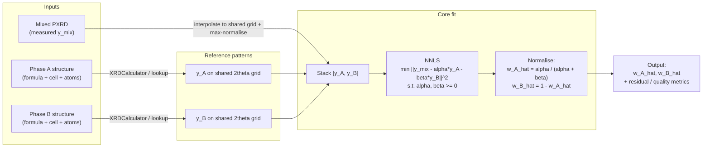
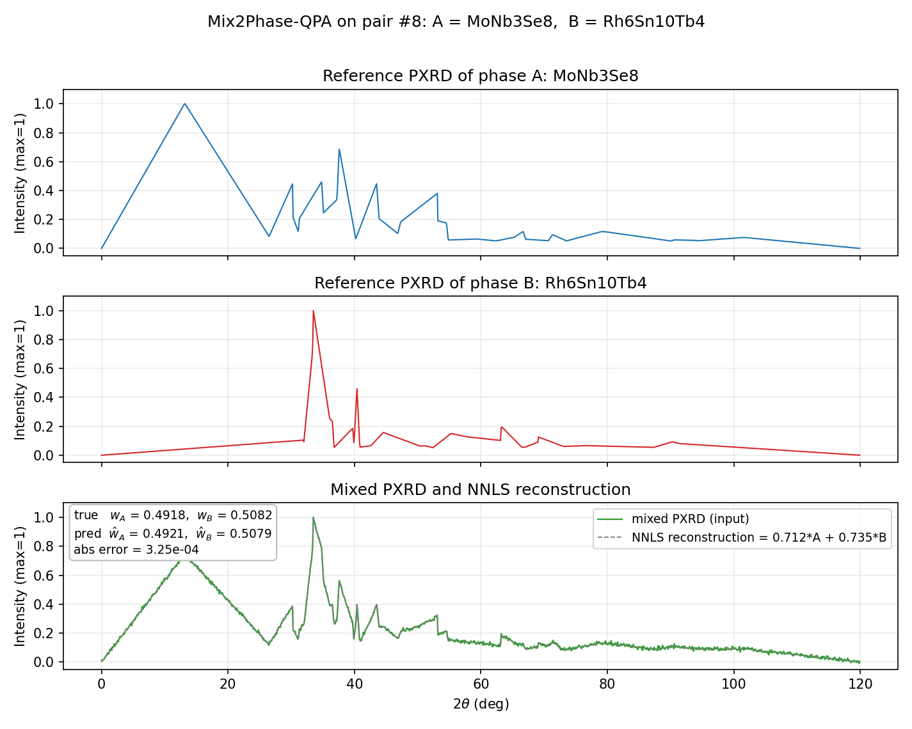
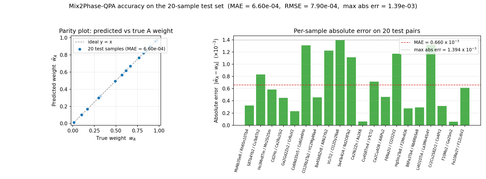

# Mix2Phase-QPA

**Mix2Phase-QPA** stands for **Mixture 2-Phase Quantitative Phase Analysis**.  
它解决的是一个非常具体的 PXRD 定量问题：

> 当样品的主要物相已经缩小到 **A / B 两相**，并且这两相的单相参考谱可查或可生成时，如何用一条混合 PXRD 快速估计两相比例。

本项目采用的主线方法是：

`混合谱 + 两条参考谱 -> NNLS -> A/B 占比`

## Usage Flow



In one line: **structure of A + structure of B + measured mixed PXRD -> two reference patterns -> non-negative least squares -> normalised weights**.

## Demo: A, B and Mixed PXRD on a Real Test Pair

The figure below is generated automatically by [`scripts/make_readme_figures.py`](scripts/make_readme_figures.py) from the bundled 20-sample evaluation. It shows test pair `#8` (`A = MoNb3Se8`, `B = Rh6Sn10Tb4`):

- top: max-normalised reference PXRD of phase A
- middle: max-normalised reference PXRD of phase B
- bottom: input mixed PXRD (green) overlaid with the NNLS reconstruction `alpha*A + beta*B` (dashed grey), with the true / predicted A weight printed in the inset



For this pair the true mixing ratio is `w_A = 0.4918`, the predicted value is `w_A_hat = 0.4921`, i.e. an absolute error of `3.25e-04`.

## Accuracy on the 20-Sample Test Set

Aggregated metrics on the 20 randomly drawn test pairs (`results/eval20_summary.json`):

| metric | value |
| --- | --- |
| MAE of `abs(w_A_hat - w_A)` | **6.60e-04** |
| RMSE | **7.90e-04** |
| max absolute error | **1.39e-03** |
| failed runs | 0 / 20 |



The left panel shows that all 20 predictions sit on top of the ideal `y = x` line; the right panel shows per-sample absolute errors are uniformly below `1.4 x 10^-3`, with the dashed red line marking the dataset MAE.

To regenerate the two PNGs above after re-running the evaluation:

```bash
python3 scripts/make_readme_figures.py
```

(`docs/figures/` will be created automatically; the script reads `results/eval20_summary.json` and the bundled `data/mp20_data/test.lmdb`.)

## Repository Contents

| Path | Description |
| --- | --- |
| [`scripts/`](scripts/) | Core inference, CIF fallback, and evaluation scripts |
| [`Mix2Phase-QPA_全文.md`](Mix2Phase-QPA_全文.md) | 中文完整说明 |
| [`Mix2Phase-QPA_full_EN.md`](Mix2Phase-QPA_full_EN.md) | English documentation |
| [`报告_Mix2Phase-QPA_项目总结.md`](报告_Mix2Phase-QPA_项目总结.md) | 中文汇报版总结 |
| [`results/`](results/) | Example generated artifacts and evaluation summaries |
| [`data/README.md`](data/README.md) | Data layout, provenance notes, and expected local paths |

## Quick Start

```bash
python3 -m venv .venv
source .venv/bin/activate
pip install -r requirements.txt
```

Daily inference from the repository root:

```bash
python3 scripts/algo_qpa_mixture_nnls.py \
  --mixture /path/to/mix.xy \
  --ref-a-mp20 <idx_a> \
  --ref-b-mp20 <idx_b>
```

Batch evaluation wrappers:

```bash
bash scripts/run_eval20.sh
bash scripts/run_fixed_pair_w10.sh
```

More script examples are in [`scripts/README.md`](scripts/README.md).

## Data Availability

This repository includes:

- scripts
- documentation
- small metadata files such as `data/mp20_data/test.csv`
- example result artifacts under `results/`

This repository does **not** currently redistribute the full runtime LMDB datasets by default.  
If you want to reproduce the bundled evaluations, you must place the required files at the expected local paths:

- `data/pair1k_v3/{train,val,test}.lmdb`
- `data/mp20_data/test.lmdb`

See [`data/README.md`](data/README.md) for the expected layout and provenance notes.  
Before publishing this repository publicly, make sure you have the right to redistribute any external data.

## Included Results

| Path | Description |
| --- | --- |
| [`results/eval20_summary.json`](results/eval20_summary.json) | 20-sample evaluation summary |
| [`results/q1_eval20_run/`](results/q1_eval20_run/) | Example mixed-pattern `.xy` files |
| [`results/fixed_pair_w10_summary.json`](results/fixed_pair_w10_summary.json) | Fixed-A/B sweep across 10 ratios |
| [`results/fixed_pair_w10_run/`](results/fixed_pair_w10_run/) | Synthetic mixed-pattern `.xy` files for the fixed-pair sanity check |

The fixed-pair 10-ratio experiment is a **sanity check** rather than an independent benchmark: the mixtures are synthesized from the same lookup references used during fitting.

## Notes for Public Release

- Choose and add a repository license before publishing.
- Confirm redistribution rights for any dataset copied from external sources.
- If full LMDB data is too large or cannot be redistributed, publish only scripts/docs/results and provide a separate data acquisition path.
