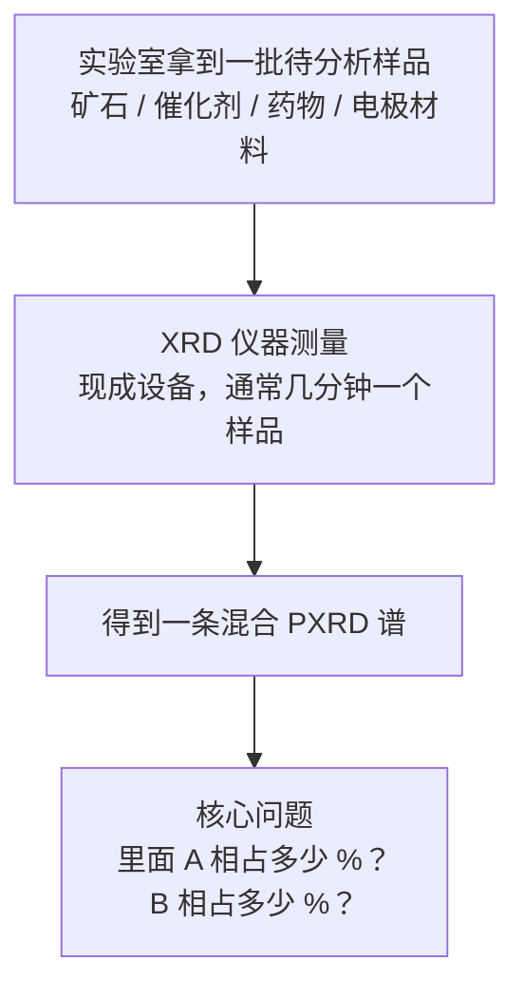
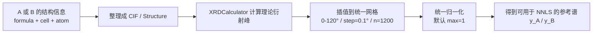
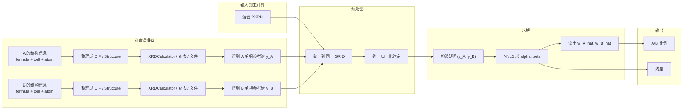
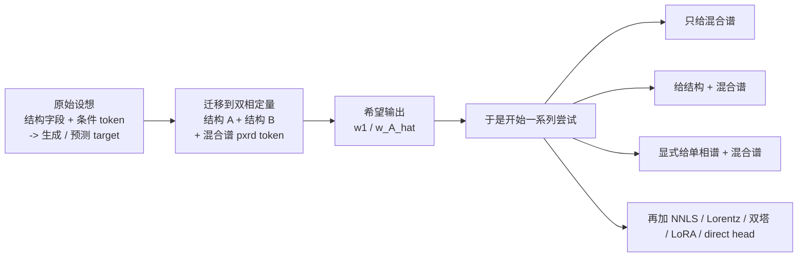
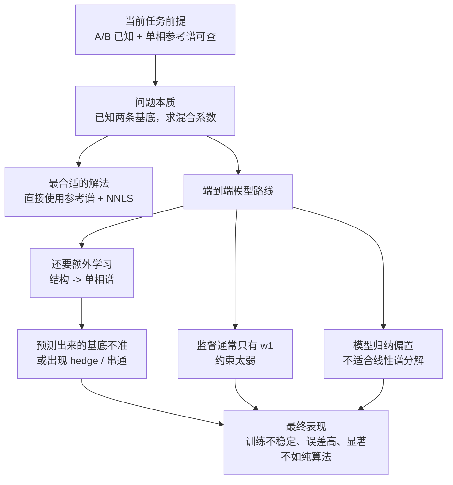

# Mix2Phase-QPA 项目报告

**方案名**：Mix2Phase-QPA（Mixture 2-Phase Quantitative Phase Analysis）  
**中文名**：混合粉末 PXRD 双相线性定量（双参考谱 + NNLS）  
**文档定位**：这是一份面向汇报和结题的总结稿。更完整的说明、命令和结果索引见 [`Mix2Phase-QPA_全文.md`](Mix2Phase-QPA_全文.md)。

---

## 0. 一页结论

本项目最终确认：在“**样品主要由 A、B 两相组成，且 A/B 的单相参考 PXRD 可查**”这一前提下，问题本质上是一个**双基底非负线性反演问题**，并不需要再用大模型做端到端预测。

我们最终采用的方案是：

1. 读取一条混合 PXRD；
2. 查表得到 A、B 的单相参考谱；
3. 统一到同一 `2θ` 网格和同一归一化约定；
4. 用 **NNLS** 求解两条参考谱的非负组合系数；
5. 将系数归一化为 A/B 比例。

在当前同源仿真设定下：

- **20 个随机样本**：MAE = **6.60×10⁻⁴**
- **固定同一 A/B、扫描 10 个比例**：MAE = **1.82×10⁻¹⁰**

这说明：只要前提成立，Mix2Phase-QPA 已经能把当前任务做得非常准确、非常稳定，而且比之前的 Uni-3DAR 路线更简单、更可解释、更适合实验落地。

---

## 1. 任务内容、实验理解与任务定义

### 1.1 任务到底是什么？

本任务要解决的不是“未知物相自动识别”，而是一个更具体、也更贴近实验流程的问题：

> 已知样品主要由 **A、B 两个晶相**构成，并且这两个相的**单相参考 PXRD 可以查到**。现在给定一条混合粉末 PXRD，求 A、B 两相在混合样中的相对比例。

在本项目的数据约定中：

- `w1` 表示 **A 相真值比例**
- `1 - w1` 表示 **B 相真值比例**

算法输出对应为：

- `w_A_hat`：A 相预测比例
- `w_B_hat = 1 - w_A_hat`

### 1.2 我们对实验任务的理解

如果站在实验室实际工作流里看，这个任务通常来自下面这个场景：



这说明实验端真正关心的不是“谱长什么样”，而是**谱背后的物相比例**。

- 对矿石样品，这关系到矿物组成与品位判断
- 对催化剂和电极材料，这关系到活性相/副相比例
- 对药物体系，这关系到不同晶型或杂相含量

所以，“定量相分析”是一个非常典型、也非常有实验价值的问题。

不过，本项目要解决的并不是“从完全未知样品里自动识别全部物相”的全流程问题，而是这个流程中的**一个关键子问题**。

从方法上说，这个任务应拆成两个阶段：

1. **相鉴定阶段**  
   通过先验配方、PDF 卡片、上游分析等方法确认：当前样品中主要参与衍射的是 **A 相和 B 相**。

2. **定量阶段**  
   在 A/B 已知后，用一条混合 PXRD 去求这两相各占多少。

所以更准确地说，实验上样品最初可以是“未知样品”，但当研究人员已经把候选相范围缩到 A/B 两相以后，当前任务的重心就不再是“谱里到底有什么”，而是：

> 在“已经知道就是 A/B 两相”的前提下，能不能把比例算准。

这也是为什么我们最终选择了纯算法路线，而不是继续在“未知体系识别 + 比例回归”这类更重的问题上使用大模型。

### 1.3 任务定义（数学形式）

在近似随机取向、两相主导、谱形可比的前提下，混合谱可写成：

```text
y_mix ≈ alpha * y_A + beta * y_B
alpha >= 0, beta >= 0
```

其中：

- `y_A`：A 相单相参考谱
- `y_B`：B 相单相参考谱
- `y_mix`：混合谱
- `alpha, beta`：两条参考谱在混合谱中的非负贡献系数

比例读回方式为：

```text
w_A_hat = alpha / (alpha + beta)
w_B_hat = 1 - w_A_hat
```

所以，本任务的最小可行定义可以概括为：

> 在两条已知参考谱张成的非负锥内，找到最接近混合谱的一点，再把对应系数读成比例。

---

## 2. 本方案的输入、输出、Pipeline 与示例

### 2.1 输入与输出

| 类型 | 名称 | 具体形式 | 作用 |
| --- | --- | --- | --- |
| 输入 | 混合 PXRD | `.xy/.csv/.txt` 两列 `(2θ, I)`，或已对齐的 1200 维向量 | 被分解的目标谱 |
| 输入 | A 参考谱 | 优先使用 mp20 查表（cursor 顺序索引）；也支持文件参考谱 | 参考基底 1 |
| 输入 | B 参考谱 | 同上 | 参考基底 2 |
| 输出 | `w_A_hat` | 浮点数，范围 `[0, 1]` | A 相预测比例 |
| 输出 | `w_B_hat` | `1 - w_A_hat` | B 相预测比例 |
| 输出 | `residual_l2_nnls` | 浮点数 | 拟合残差，用于判断当前 A/B 是否合理 |

### 2.2 A/B 的参考谱是怎么从结构信息得到的？

在正式进入 NNLS 计算之前，还需要先回答一个关键问题：

> 如果手里还没有 A、B 的单相参考 PXRD，而只有它们的 `formula`、`cell`、`atom` 这些基础结构信息，该怎样得到参考谱？

本项目里，这条路径是明确的。  
如果 A 或 B 已经有现成参考谱，那么可以直接查表或读文件；如果只有结构信息，那么就先把这些信息整理成 **CIF / Structure**，再通过晶体学 PXRD 计算器生成单相参考谱。

对应流程如下：



可以把它理解成 4 个步骤：

1. **从结构信息恢复晶体结构对象**  
   已知 `formula + cell + atom` 时，本质上已经足够描述一个晶体结构。实际实现里，通常先写成 `.cif`，或者直接构造成 `Structure` 对象。

2. **从结构计算理论 PXRD 峰位与峰强**  
   本项目的 CIF 备选路径使用 `pymatgen.analysis.diffraction.xrd.XRDCalculator`。  
   它会根据结构、波长和 `2θ` 范围，计算出该单相的理论衍射峰。

3. **把离散峰转成统一的稠密向量**  
   计算器直接输出的通常是“若干峰位 + 峰强”，但 NNLS 需要的是和混合谱同网格的向量。  
   所以这里还要经过一次插值 / 重采样，把谱统一到：
   - `2θ: 0–120°`
   - `step = 0.1°`
   - `n = 1200`

4. **做同一归一化约定**  
   当前默认使用 `max = 1` 归一化。这样得到的 `y_A`、`y_B` 才能和混合谱一起进入后续分解。

在本仓库里，这条路径对应的是 `scripts/algo_qpa_q1_cif_xy.py`。  
也就是说，如果只有 A/B 的结构文件，没有现成参考谱，理论上可以先走：

`structure -> CIF -> XRDCalculator -> 插值 -> 归一化 -> 参考谱`

再进入后面的 NNLS 求解。

不过，这里必须强调一个很重要的实验事实：

> **从 CIF 用 XRDCalculator 算出来的参考谱，不一定和你的混合谱处在同一个谱形空间里。**

原因在于，真实混合谱往往还包含仪器展宽、背景、噪声、峰形差异、样品取向等因素；而理论谱通常更“干净”。  
所以，如果混合谱和参考谱不是同一条生成链出来的，就会出现 **domain gap**，这时程序虽然还能输出比例，但误差可能反映的是“谱形失配”，而不只是 NNLS 本身的数值误差。

因此，本项目对主结果的推荐顺序是：

1. **优先使用与混合谱同源的查表参考谱**
2. **其次使用已经过一致预处理的文件参考谱**
3. **最后才是 CIF -> XRDCalculator 的备选路径**

### 2.3 Pipeline（一步一步说清楚）

为了让混合谱和参考谱真正“可以比较”，本方案按下面顺序工作：

1. **读取混合谱** `y_mix`
2. **查表或读文件**拿到 `y_A`、`y_B`
3. **统一网格**  
   三条谱都对齐到同一稠密网格：
   - `2θ` 范围：`0–120°`
   - 步长：`0.1°`
   - 点数：`1200`
4. **统一强度约定**  
   当前默认对每条谱做 `max = 1` 归一化，避免绝对强度标度不一致
5. **构造两列设计矩阵**

```text
X = [y_A, y_B]
```

6. **求解 NNLS**

```text
(alpha_hat, beta_hat)
= argmin over alpha, beta >= 0
  || y_mix - alpha * y_A - beta * y_B ||_2
```

7. **把系数读成比例**

```text
w_A_hat = alpha_hat / (alpha_hat + beta_hat)
```

8. **输出比例与残差**

### 2.4 流程图



### 2.5 示例演示

以本项目已生成的样本为例：

| 项目 | 内容 |
| --- | --- |
| A | `MoNb3Se8` |
| B | `Rh6Sn10Tb4` |
| 混合谱 | `results/q1_eval20_run/000_pair0008/mix.xy` |

运行命令：

```bash
cd /path/to/Mix2Phase-QPA
python3 scripts/algo_qpa_mixture_nnls.py \
  --mixture results/q1_eval20_run/000_pair0008/mix.xy \
  --ref-a-mp20 1387 \
  --ref-b-mp20 8021
```

对应结果：

| 项 | 数值 |
| --- | --- |
| `w1` 真值 | `0.491759` |
| `w_A_hat` 预测值 | `0.492084` |
| 绝对误差 `abs(e)` | `0.000325` |

这个例子说明：在当前查表同源设定下，算法确实能把比例稳定读出来。

---

## 3. 测试结果

### 3.1 纵向对比：20 个随机样本

#### 3.1.1 汇总指标

| 指标 | 数值 |
| --- | --- |
| MAE(abs(w_A_hat - w1)) | **6.60×10⁻⁴** |
| RMSE | **7.90×10⁻⁴** |
| max absolute error | **1.39×10⁻³** |

#### 3.1.2 20 个示例明细

| # | pair | A | B | 混合 PXRD | `w1` 真值 | `w_A_hat` 预测 | `abs(e)` |
| --- | --- | --- | --- | --- | --- | --- | --- |
| 1 | 8 | MoNb3Se8 | Rh6Sn10Tb4 | `results/q1_eval20_run/000_pair0008/mix.xy` | 0.491759 | 0.492084 | 0.000325 |
| 2 | 9 | S8Tb4Yb2 | CuTe6Th2 | `results/q1_eval20_run/001_pair0009/mix.xy` | 0.616726 | 0.615894 | 0.000833 |
| 3 | 14 | Ho3Mn8Tm | Mn2Si2Sm | `results/q1_eval20_run/002_pair0014/mix.xy` | 0.968152 | 0.967566 | 0.000586 |
| 4 | 20 | Cd2Ho | Ce2Ru2Si2 | `results/q1_eval20_run/003_pair0020/mix.xy` | 0.670527 | 0.670077 | 0.000450 |
| 5 | 42 | Ga2Gd2Zn2 | CrRuV2 | `results/q1_eval20_run/004_pair0042/mix.xy` | 0.897469 | 0.897239 | 0.000230 |
| 6 | 50 | Co6Nd3Sn5 | Co6Ge6Ho | `results/q1_eval20_run/005_pair0050/mix.xy` | 0.840651 | 0.841960 | 0.001309 |
| 7 | 54 | Cl12Rb2Ta2 | H12Mg4Na4 | `results/q1_eval20_run/006_pair0054/mix.xy` | 0.313685 | 0.313231 | 0.000455 |
| 8 | 55 | Ba4Sb8Zn8 | AlNi2Yb2 | `results/q1_eval20_run/007_pair0055/mix.xy` | 0.955436 | 0.956660 | 0.001224 |
| 9 | 62 | IrLiTi2 | Cl12Dy2Na6 | `results/q1_eval20_run/008_pair0062/mix.xy` | 0.846184 | 0.844790 | 0.001394 |
| 10 | 69 | Se4Te4U4 | Nd2O8Ta2 | `results/q1_eval20_run/009_pair0069/mix.xy` | 0.167545 | 0.168659 | 0.001114 |
| 11 | 72 | Ce2Ni2Zn | As2K6 | `results/q1_eval20_run/010_pair0072/mix.xy` | 0.897233 | 0.897173 | 0.000060 |
| 12 | 76 | Cu4S8Tm4 | IrTcTi2 | `results/q1_eval20_run/011_pair0076/mix.xy` | 0.667119 | 0.667834 | 0.000716 |
| 13 | 77 | Ca2Cu4O8 | Al6Pu2 | `results/q1_eval20_run/012_pair0077/mix.xy` | 0.304789 | 0.305252 | 0.000464 |
| 14 | 80 | F6Na2U | Cl2O2V2 | `results/q1_eval20_run/013_pair0080/mix.xy` | 0.845331 | 0.846503 | 0.001172 |
| 15 | 84 | Hg5In2Te8 | F2Mn4O6 | `results/q1_eval20_run/014_pair0084/mix.xy` | 0.765189 | 0.765467 | 0.000277 |
| 16 | 93 | B6Fe3Tb4 | Nb6RbSe8 | `results/q1_eval20_run/015_pair0093/mix.xy` | 0.100568 | 0.100859 | 0.000291 |
| 17 | 96 | Li4O10Ti4 | La3Mn4Si4Y | `results/q1_eval20_run/016_pair0096/mix.xy` | 0.567779 | 0.566463 | 0.001317 |
| 18 | 98 | Cr2Cu2S8Zr2 | Co4Pr2 | `results/q1_eval20_run/017_pair0098/mix.xy` | 0.298595 | 0.298910 | 0.000315 |
| 19 | 101 | F10Mo2 | Ga2Sm2 | `results/q1_eval20_run/018_pair0101/mix.xy` | 0.011631 | 0.011574 | 0.000056 |
| 20 | 107 | Fe10Re2Y | F12Li6V2 | `results/q1_eval20_run/019_pair0107/mix.xy` | 0.820094 | 0.820708 | 0.000614 |

### 3.2 横向对比：固定同一 A/B，扫描 10 个比例

#### 3.2.1 固定 pair

- A = `BaCu2O4Sr`
- B = `Ga2H2O4`
- 来源于 50 样本评测中的 `pair_idx=73`

#### 3.2.2 汇总指标

| 指标 | 数值 |
| --- | --- |
| MAE(abs(w_A_hat - w_A)) | **1.82×10⁻¹⁰** |
| RMSE | **2.11×10⁻¹⁰** |
| max absolute error | **3.98×10⁻¹⁰** |

#### 3.2.3 10 个示例明细

| # | A | B | 混合 PXRD | `w_A` 真值 | `w_A_hat` 预测 | `abs(e)` |
| --- | --- | --- | --- | --- | --- | --- |
| 1 | BaCu2O4Sr | Ga2H2O4 | `results/fixed_pair_w10_run/00_w050/mix.xy` | 0.050000 | 0.050000 | 2.23e-10 |
| 2 | BaCu2O4Sr | Ga2H2O4 | `results/fixed_pair_w10_run/01_w150/mix.xy` | 0.150000 | 0.150000 | 2.81e-10 |
| 3 | BaCu2O4Sr | Ga2H2O4 | `results/fixed_pair_w10_run/02_w250/mix.xy` | 0.250000 | 0.250000 | 1.04e-10 |
| 4 | BaCu2O4Sr | Ga2H2O4 | `results/fixed_pair_w10_run/03_w350/mix.xy` | 0.350000 | 0.350000 | 2.37e-10 |
| 5 | BaCu2O4Sr | Ga2H2O4 | `results/fixed_pair_w10_run/04_w450/mix.xy` | 0.450000 | 0.450000 | 2.03e-10 |
| 6 | BaCu2O4Sr | Ga2H2O4 | `results/fixed_pair_w10_run/05_w550/mix.xy` | 0.550000 | 0.550000 | 1.96e-10 |
| 7 | BaCu2O4Sr | Ga2H2O4 | `results/fixed_pair_w10_run/06_w650/mix.xy` | 0.650000 | 0.650000 | 3.82e-11 |
| 8 | BaCu2O4Sr | Ga2H2O4 | `results/fixed_pair_w10_run/07_w750/mix.xy` | 0.750000 | 0.750000 | 3.98e-10 |
| 9 | BaCu2O4Sr | Ga2H2O4 | `results/fixed_pair_w10_run/08_w850/mix.xy` | 0.850000 | 0.850000 | 3.11e-11 |
| 10 | BaCu2O4Sr | Ga2H2O4 | `results/fixed_pair_w10_run/09_w950/mix.xy` | 0.950000 | 0.950000 | 1.05e-10 |

#### 3.2.4 结果解读

这组横向对比说明：

1. 对**固定同一对 A/B**，算法能随真值比例平滑变化；
2. 在“参考谱与混合谱同源”的理想场景下，比例恢复几乎达到数值精度极限；
3. 因此，当前纵向 20 样本中的 `10^-4 ~ 10^-3` 误差，并不是比例恢复本身困难，而主要是不同物相组合下的谱形差异、插值与数值误差。

---

## 4. 算法结构、原理与为何能算出比例

### 4.1 算法结构

本方案的结构非常简单，不依赖深度网络：

1. **参考谱获取层**
   - A、B 的单相参考谱通过 mp20 查表或文件读入得到
2. **预处理层**
   - 三条谱统一到同一 GRID
   - 统一强度归一化
3. **求解层**
   - 用 `scipy.optimize.nnls` 解 `alpha, beta`
4. **读出层**
   - 输出 `w_A_hat = alpha / (alpha + beta)`

### 4.2 算法原理

本质上，算法利用的是**混合谱近似位于两条单相参考谱张成的非负锥内**这一事实。

如果：

```text
y_mix = w_A * y_A + (1 - w_A) * y_B + epsilon
```

且噪声 `epsilon` 较小，那么通过 NNLS 在 `[y_A, y_B]` 这两列上做拟合，就可以恢复出最接近的非负系数。

### 4.3 为什么能算出比例？

原因有三条：

1. **物理上是线性叠加问题**  
   当前任务设定不是“未知多相全局识别”，而是“已知双相、求混合比例”，本身就非常接近线性逆问题。

2. **参考谱是显式可用的**  
   一旦 A、B 的单相谱已知，比例问题就从“复杂的结构生成/识别任务”退化为“已知基底上的系数求解”。

3. **NNLS 与物理约束一致**  
   两相贡献不可能为负，NNLS 正好把解限制在 `alpha >= 0, beta >= 0` 的可行域内。

因此，在当前前提下，比例之所以能被精确恢复，并不是因为模型很复杂，而是因为**问题本身已经被正确地转换为线性求解问题**。

---

## 5. 前置条件与局限性

### 5.1 前置条件

| 条件 | 说明 |
| --- | --- |
| A/B 两相身份已知 | 这是相鉴定之后的定量问题，不负责找相 |
| A/B 的单相参考谱可查或可生成 | 可以来自库、标样或一致模拟 |
| 混合谱与参考谱可比 | 同一 2θ 网格、同一归一化、相近仪器函数 |
| 样品主要为两相 | 若第三相、非晶、强背景过强，会破坏两列模型 |
| 近似随机取向 | 强择优取向会扭曲线性叠加假设 |

### 5.2 局限性

1. **不是全未知体系求解器**  
   它不能只靠一条混合谱自动找出所有相。

2. **不是严格 Rietveld 精修**  
   输出的是“非负线性比例”，不直接等价于完整晶体学精修结果。

3. **依赖参考谱质量**  
   若参考谱和混合谱不在同一谱形空间里，算法仍会给出数字，但物理意义会下降。

4. **衍射权重不一定严格等于质量分数**  
   在吸收差异大、微吸收明显时，这一点尤其需要注意。

---

## 6. 之前所有实验与尝试的总结：为什么我们最后不用 Uni-3DAR 模型

本项目在确定纯算法主线之前，实际做过一整条 Uni-3DAR / Transformer / 端到端回归路线。之所以要把这段历史写清楚，是因为最终选择 Mix2Phase-QPA，并不是“拍脑袋换方向”，而是经过多轮实验后得出的结论：

> 在“**A/B 已知，A/B 单相参考谱可查**”这一设定下，端到端模型是在用一个更重、更难、更不稳定的方法，去逼近一个本来就有解析解的线性问题。

### 6.1 为什么一开始会想到用模型？

最初会想到 Uni-3DAR，核心原因并不是“它能做任意回归”，而是：

- 从论文看，Uni-3DAR 是一个**统一 3D 生成与理解**框架；
- 对晶体任务，它既能做 **PXRD / 组成条件下的结构生成**，也能在结构级别挂 **prediction head** 做单结构标量预测；
- 从我们的本地项目实现看，我们当时围绕 Uni-3DAR 实际组织过的输入主要包括：

- `formula`
- `atom_type / atom_pos / lattice_matrix`
- `pxrd token`

但这里需要更严谨地说明两点：

1. **`formula` 不是论文里最核心的原生结构输入**  
   论文和代码里的晶体主输入，本质上是 `atom_type / atom_pos / lattice_matrix` 这套结构字段；  
   `formula_pair 256-d` 这类成分向量，是我们在 R2 期额外做的任务侧扩展，不是 Uni-3DAR 论文的标准主干输入。

2. **`atom tree / cell tree` 更准确地说是模型内部的 token 化结果，不是样本侧直接提供的原始字段**  
   也就是说，样本先提供结构信息，之后 Uni-3DAR 再把它变成 octree / tree token、atom token、xyz token 以及 lattice 相关 token。

所以，更准确的原始设想应该表述为：

> 既然 Uni-3DAR 已经支持“结构 + 条件 -> 结构生成”，也支持“单结构 -> 单标量预测”，那么是否可以进一步把当前任务改写成“结构 A + 结构 B + 混合 PXRD -> 两相比例”？

更具体地说，最初我们的思路其实是这样的：

如果把 Uni-3DAR 论文里的“晶体结构 + 条件 + 自回归 / prediction head”这一套范式迁移到当前任务，那么对于双相定量，是否也可以把问题组织成：

- A 相的结构输入：`atom_type_A / atom_pos_A / lattice_matrix_A`
- B 相的结构输入：`atom_type_B / atom_pos_B / lattice_matrix_B`
- 可选的组成 / formula 信息
- 再加上一条混合谱的 `pxrd token`

然后直接送进 Uni-3DAR，让模型输出：

- `A 相占比`
- 或者等价地输出 `w1 / w_A_hat`

这个设想在当时是很自然的，因为它延续了我们对 Uni-3DAR 的一个基本期待：  
**既然模型可以同时接收结构条件和 PXRD 条件，那么也许它能够直接学会“两个候选相 + 一条混合谱 -> 两相比例”这个映射。**

这一思路可以概括成下面这张路线图：



下面就按照这条探索路径，说明每一类方案到底输入了什么、做了什么，以及最后为什么失败。  
从“AI 自动完成任务”的角度，这条思路很自然；但真正做下来后，我们发现它和当前任务的物理本质并不匹配。

### 6.2 尝试脉络（按“模型到底看到了什么”来整理）

下面这张表，不再只写阶段名，而是明确写出：**模型的输入到底是什么、流程大致是什么、结果怎样**。

| 路线 | 模型实际输入 | 大致流程 | 代表结果 | 我们得到的判断 |
| --- | --- | --- | --- | --- |
| **Mix-only 回归**（TEST 1k / A 10k / B / C） | 只有一条混合谱 `y_mix`；在 Uni-3DAR 语境下，就是把 `y_mix` 编成一串 PXRD token，再送入 backbone | `y_mix / pxrd token -> encoder/backbone -> pooling -> 直接回归 w1` | 相关性接近 0，预测坍塌到常数 | 只给混合谱、不告诉模型 A/B 参考基底，本质上是欠定问题 |
| **结构 + 混合谱**（D / R2 / R4） | A/B 的 `formula`、`atom_type / atom_pos / lattice_matrix`，外加 `y_mix` 的 PXRD token；其中 R2 甚至尝试过 `formula_pair 256-d + A 占位结构 + y_mix`，R4 才是双完整结构 | `结构 token + pxrd token -> Uni-3DAR -> 直接回归 w1` | R4 一度仍接近 constant collapse，README 中记录 test MAE 约 `0.259`、相关性为负 | 让模型同时学“结构 -> 单相谱”和“混合谱 -> 比例”，任务过重 |
| **显式给单相谱**（D' / Tiny diag） | `yA`、`yB`、`y_mix` 三条谱，作为 raw 1200 维向量或 token 序列送入 Transformer | `yA,yB,y_mix -> Transformer -> 回归 w1` | 仍学不好，远不稳定 | 说明不是“信息不够”，而是 Transformer 对线性分解任务归纳偏置不对 |
| **MLP fallback** | 直接拼接 `[yA, yB, y_mix]` | `[yA,yB,y_mix] -> MLP -> w1` | `r ≈ 0.945` | 信号本身是够的；说明问题不在标签，而在模型形式 |
| **NNLS-guided family**（R5 / R5.1） | A/B 结构 + `y_mix`；模型不再直接报比例，而是先输出某种单相谱表征 | `结构 token + pxrd token -> 预测 \hat y_A,\hat y_B -> NNLS -> w1` | R5 系列已能解掉最严重的 collapse，但 MAE 仍约 `0.420` / `0.395` | 加入物理先验后变好，但离纯算法仍很远 |
| **Lorentz head family**（A2 / A2.1） | A/B 结构 + `y_mix`；head 不再直接出 1200 点，而是出 Lorentz 峰参数 | `结构 token + pxrd token -> Lorentz peak params -> \hat y_A,\hat y_B -> NNLS -> w1` | A2 已明显好于早期 collapse，但仍远高于纯算法 | 方向更合理，但仍然是在“学一个原本可直接查表的参考谱” |
| **B'**（双塔 + PXRD cond + LoRA + direct head） | A 相结构塔、B 相结构塔、同一条 `y_mix` 的 PXRD token；每塔只看自己的结构和共同的混合谱 | `Tower A/B + y_mix cond -> \hat y_A,\hat y_B -> NNLS，同时 MLP direct head -> w1` | `test MAE_nnls` 最好约 `0.349`；5 个样本上 direct head 几乎是常数 | 已是深度路线里较成熟的版本，但仍不具备与纯算法竞争的必要性 |

### 6.3 几条关键路线，具体是怎么失败的？

下面把最关键的几类失败讲具体。

#### 6.3.1 只用混合谱 `y_mix` 直接回归 `w1`，为什么会失败？

这条路线最早做得最多，因为它最“像一个标准回归任务”：

```text
y_mix -> w1_hat
```

但问题在于，模型只看到了**一条混合曲线**，却没有看到：

- A 的参考谱是什么
- B 的参考谱是什么
- 混合谱到底是在哪两条基底上叠出来的

这会导致一个根本性困难：

> 同一条混合谱，在不知道参考基底的情况下，往往可以对应很多种潜在解释。

对模型来说，它最容易学到的不是“正确比例”，而是训练集里的**平均比例**或某种保守常数。因此早期实验中，相关性接近 0，预测分布极窄，典型表现就是 **constant collapse**。

换句话说，这类失败不是因为模型不够大，而是因为：

> 输入本身没有把问题变成一个良定问题。

#### 6.3.2 输入 `formula + 结构 + y_mix`，为什么还是失败？

后来我们尝试把问题“补全”：

- 给 A/B 的 `formula`
- 给 A/B 的完整结构
- 再给混合谱 `y_mix`

看起来模型应该能够：

1. 从结构推单相谱
2. 再从混合谱反推比例

但实际效果仍然很差。原因在于，这时模型被要求同时完成三件事：

1. **理解晶体结构**
2. **从结构隐式生成单相 PXRD**
3. **再把两条隐式单相谱与混合谱对应起来，输出比例**

这相当于把一个原本可以拆解成“查表 + 线性求解”的问题，重新变成了一个**大规模隐式生成 + 反演问题**。  
在当前 `1k` 规模数据上，这个目标太重，监督又只有一个标量 `w1`，所以模型很容易退化到：

- 结构分支学不出稳定的单相谱
- 或者根本不认真用结构，直接输出接近常数的比例

README 中对 `R4` 的总结就已经很说明问题：即便喂入了双完整结构和混合谱，模型仍然会出现 **constant collapse**，相关性甚至为负。

#### 6.3.3 明明把 `yA、yB、y_mix` 都给了，为什么 Transformer 还是不如 MLP？

这是整个项目里最关键的一条证据。

我们后来做过一种更强的输入设定：把

- 单相谱 `yA`
- 单相谱 `yB`
- 混合谱 `y_mix`

都显式给模型。此时信息已经非常充分，因为理论上：

```text
y_mix ≈ w1 * y_A + (1 - w1) * y_B
```

如果模型真的学会了这个关系，就应该能把比例读出来。

结果是：

- **Transformer / Uni-3DAR 风格模型**：仍然不稳定，学得不好
- **简单 MLP fallback**：反而能做到 `r ≈ 0.945`

这一点非常关键，因为它说明：

1. **标签不是错的**
2. **信号不是没有**
3. **问题不在数据噪声**
4. **问题在模型归纳偏置**

也就是说，当前任务更像一个低维、强结构化、近似线性的函数拟合问题；简单 MLP 都能抓住，Transformer 却抓不稳，说明后者并不是这道题最合适的工具。

#### 6.3.4 R5 / A2 / A2.1 / B' 明明已经加了 NNLS 和物理先验，为什么还是不够？

这部分是最值得说明的，因为它代表了我们已经尽量“帮模型”了。

这些改进版的共同思路是：

- 不再让模型直接裸回归 `w1`
- 而是让模型先输出某种“单相谱表征”
- 再把 **NNLS** 接到后面
- 或者让 head 改成更物理的 **Lorentz peak** 参数化

这比最早的纯黑盒回归显然更合理，也确实带来了改进：

- R5 系列：已经能把最严重的 constant collapse 解掉
- A2 / A2.1：进一步用 Lorentz head 增强物理先验
- B'：再用双塔、PXRD 条件、LoRA、direct head 去压 hedge

但为什么它们最后仍不如纯算法？

因为它们仍然绕不开一个根本问题：

> 模型还在“学习生成参考谱”，而不是“直接使用已知参考谱”。

只要模型预测出来的 `y_A_hat, y_B_hat` 不是足够准确，后面的 NNLS 就只能在“不完全正确的基底”上解比例。  
这会带来两个典型问题：

1. **basis 不准**  
   预测出来的 A/B 单相谱与真实参考谱有偏差，导致后续比例读出也偏。

2. **hedge / 串通**  
   两个分支并不一定各自学到“自己的相”，而可能学成两条彼此相关、彼此妥协的伪基底；这样虽然训练 loss 不一定立刻爆炸，但比例解释会变差。

`B'` 的 5 样本对比就是一个很好的例子。日志里记录到：

- ground truth 分别约为 `0.765, 0.336, 0.897, 0.617, 0.287`
- `direct head` 却常常输出接近 `0.47~0.54`

这说明 direct 分支几乎在报一个**接近均值的保守常数**，并没有学到真正的样本判别。

同时，`B'` 最好的 smoke 结果也只有：

- `test MAE_nnls ≈ 0.349`

而当前纯算法已经做到：

- 20 个随机样本：`MAE ≈ 6.60×10⁻⁴`
- 固定 A/B 扫 10 比例：`MAE ≈ 1.82×10⁻¹⁰`

这不是“小幅落后”，而是**数量级上的差距**。

### 6.4 为什么端到端模型会系统性失败？这是本项目最重要的结论

把所有尝试放在一起看，失败逻辑其实可以先用一张图说清楚：



再展开说，失败原因主要有四条。

#### 原因 1：任务本身不是“从零学习”的问题，而是“带强先验的反演问题”

当前任务已经给了两个极强先验：

1. **A/B 是谁，已知**
2. **A/B 的单相参考谱，可查**

这意味着问题本质上已经不是：

> “请模型自己发现规律”

而是：

> “请在两条已知基底上求混合系数”

如果继续用端到端模型，就等于在绕远路。

#### 原因 2：标量监督太弱，支撑不起“结构 -> 单相谱 -> 比例”的整条链

很多 Uni-3DAR 路线最后只监督一个 `w1`，或者虽然加入了中间监督，但数据规模仍然太小。  
这会导致模型在巨大自由度下存在太多“看似可行、实际上无物理意义”的解。

#### 原因 3：Uni-3DAR 的擅长方向不是“线性谱分解”

Uni-3DAR 更擅长的是：

- 结构生成
- 结构条件建模
- CSP / conditional generation 一类任务

而当前任务的核心是：

- 两条参考谱
- 一条混合谱
- 求一个比例

这是一个**低维、物理先验强、线性结构清楚**的问题，不是 Uni-3DAR 的天然强项。

#### 原因 4：模型路线在做“逼近 NNLS”，而不是“利用 NNLS”

一旦 A/B 参考谱已知，最合理的做法是：

```text
(y_A, y_B, y_mix) -> NNLS -> w_A_hat
```

而不是：

```text
(structure, y_mix, tokens) -> large model -> w_A_hat
```

前者是直接解题；后者是在学着模仿一个本来就可以直接写出来的求解器。

### 6.5 为什么我们最终不用 Uni-3DAR 模型？

结论并不是“Uni-3DAR 没用”，而是：

> 在当前任务定义下，Uni-3DAR 不是性价比最高的主线。

我们最终放弃把它作为主交付方案，原因可以归纳成三条：

1. **从物理上说没必要**  
   问题已经被前置条件化简为线性反演。

2. **从实验上说不划算**  
   深度路线更复杂、更难训练、更难解释，但结果更差。

3. **从工程上说不稳定**  
   训练波动、collapse、hedge、direct head 接近常数等问题都说明它不适合作为当前阶段的正式交付。

需要强调的是：

- 如果未来任务改成“**A/B 未知**”
- 或“**参考谱不可查**”
- 或“**只给结构，不给参考谱**”

那时重新评估 Uni-3DAR 或其他模型是合理的。  
但在当前这道题里，纯算法已经给出更强、更稳、更清楚的答案。

---

## 7. 本方案的意义：能给实验带来什么好处？

### 7.1 对实验最直接的意义

本方案可以给实验人员提供一个**快速、稳定、可解释**的双相比例估计器：

- 输入：混合谱 + 两条参考谱
- 输出：A/B 比例 + 残差

这比“训练一个黑盒比例网络”更符合实验使用习惯。

### 7.2 它带来的具体好处

| 好处 | 说明 |
| --- | --- |
| 快 | 计算量极小，几乎实时 |
| 稳 | 在同源或条件匹配时非常准 |
| 可解释 | 输出就是两条参考谱的非负组合 |
| 易集成 | 很容易插到实验流程中的“相鉴定之后”步骤 |
| 可诊断 | 残差可直接用来判断当前 A/B 假设是否合理 |

### 7.3 它在整个项目中的意义

这个方案的重要价值不只是“结果好”，更在于它回答了一个路线判断问题：

> 在当前任务设定下，问题的本质不是复杂表征学习，而是线性分解。

这意味着：

- 我们避免了继续在错误主线上消耗时间；
- 给实验端提供了一条能立即使用的方案；
- 也为未来更复杂任务（未知物相、多相、真实仪器 domain gap）划清了边界。

### 7.4 最终结论

在“**已知 A/B，两条单相参考谱可查**”这一设定下，Mix2Phase-QPA 是当前最合理的主线方案：

1. **定义清楚**
2. **物理意义直接**
3. **实现简单**
4. **结果显著优于 Uni-3DAR 路线**
5. **更适合实验落地**

因此，本项目建议将 **Mix2Phase-QPA** 作为该任务的当前正式交付方案。
